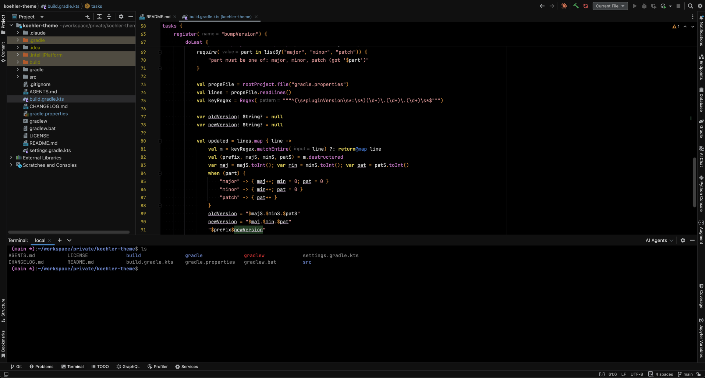

# Koehler Theme

A deep-black dark theme for IntelliJ-based IDEs, inspired by the classic Vim [`koehler`](https://github.com/rodnaph/vim-color-schemes/blob/master/colors/koehler.vim) color scheme by Ron Aaron.



## What it gives you

- **Pure black editor background** (`#000000`) with a near-black `#101010` UI chrome — ideal on OLED displays and easy on the eyes in dim rooms.
- **Vim koehler hue mapping**: yellow bold keywords, blue comments and annotations, pink-red strings and constants, pink methods and fields, white identifiers and class names, orange punctuation.
- **Toned-down accents** — saturation dialed back from Vim's vivid originals for sustained-use readability.
- **Consistent UI surfaces** — settings dialogs, popups, menus, tool windows, terminal, and notifications all unified on the same palette. No stray Darcula-blue rows, no light-gray button strips.
- **Dimmed editor chrome** — folding lines, indent guides, whitespace dots, and scrollbars sit just above the background, so they're available when you look for them but never compete with code.
- **Restrained selection and highlight backgrounds** — current line, identifier-under-caret, and search matches are subtle enough to leave the underlying code legible.

## What it does *not* change

This is a theme, not a productivity overhaul. It ships only:

- UI theme JSON (`Koehler.theme.json`)
- Editor color scheme XML (`Koehler.xml`)

No fonts, no icons, no line-spacing tweaks, no keymap changes.

## Compatibility

- IntelliJ Platform IDEs build 231+ (IntelliJ IDEA, PyCharm, WebStorm, GoLand, RubyMine, PhpStorm, CLion, DataGrip, Rider, Android Studio).
- Both Community and Ultimate editions.

## Install

**From Marketplace** (recommended): `Settings` → `Plugins` → `Marketplace` → search **Koehler Theme** → `Install`.

**From disk**: download the latest release zip, then `Settings` → `Plugins` → gear icon → `Install Plugin from Disk…`.

Activate via:
- `Settings` → `Appearance & Behavior` → `Appearance` → **Theme: Koehler**
- `Settings` → `Editor` → `Color Scheme` → **Scheme: Koehler**

> If editor colors don't update after activating, toggle the color scheme to something else and back to Koehler — the IDE caches scheme XML in memory.

## Credits

- Color palette adapted from the Vim **koehler** color scheme by [Ron Aaron](https://github.com/rodnaph/vim-color-schemes/blob/master/colors/koehler.vim).

## License

MIT — see [LICENSE](LICENSE).

---

## Development

### Build

```bash
./gradlew buildPlugin
```

The distributable zip is written to `build/distributions/`.

### Run in a sandbox IDE

```bash
./gradlew runIde
```

### Verify against target IDE versions

```bash
./gradlew verifyPlugin
```

### Bump plugin version

```bash
./gradlew bumpVersion -Ppart=patch   # 1.0.0 -> 1.0.1 (default)
./gradlew bumpVersion -Ppart=minor   # 1.0.0 -> 1.1.0
./gradlew bumpVersion -Ppart=major   # 1.0.0 -> 2.0.0
```

Updates `pluginVersion` in `gradle.properties` in place.

### Layout

- `src/main/resources/META-INF/plugin.xml` — plugin descriptor
- `src/main/resources/themes/Koehler.theme.json` — UI theme
- `src/main/resources/themes/Koehler.xml` — editor color scheme
